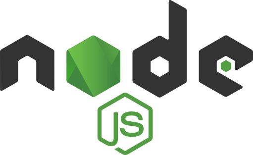
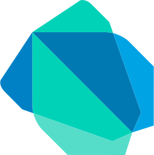
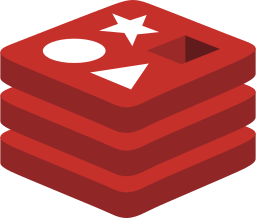
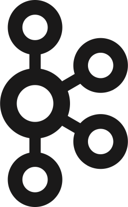
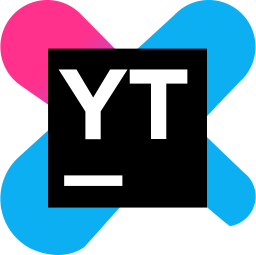
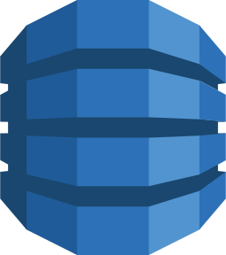
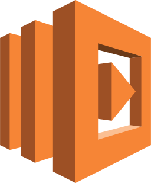
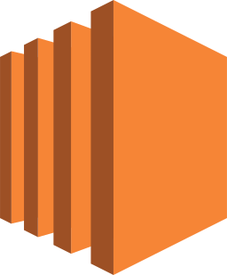

<h1 align= center style="font-size=9">👋! It's Berkay</h1>

 😕 A back-end developer at work.
🎠 A something-end developer in my dreams,  
🙈 An avid Flutter developer at side projects

---

- **Current Work:** Full Stack Developer [@BiTaksi](https://www.bitaksi.com/)
- **Twitter:** [@berkaydedeoglu](https://twitter.com/BerkayDedeoglu)
- **Vim vs Emacs:** Not sure yet. But i'm using **nvim** for now
<!-- **Website**: gelecek -->

## Tech Stack

 

  
  
  
  
  
  
  
  
  
  
  

  
   
  
  
  
  
  
  
  
  
  
  

<!--
**berkaydedeoglu/berkaydedeoglu** is a ✨ _special_ ✨ repository because its `README.md` (this file) appears on your GitHub profile.

Here are some ideas to get you started:

- 🔭 I’m currently working on ...
- 🌱 I’m currently learning ...
- 👯 I’m looking to collaborate on ...
- 🤔 I’m looking for help with ...
- 💬 Ask me about ...
- 📫 How to reach me: ...
- 😄 Pronouns: ...
- ⚡ Fun fact: ...
-->
